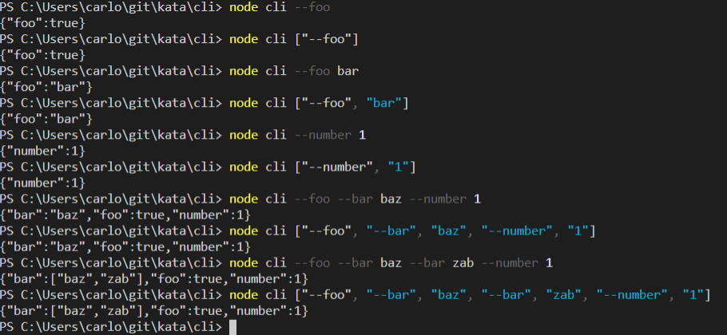

# Cli args parser kata

This is a simple cli arguments parser written in javascript. <br>

## List of supported commands

### 1. parse a `simple` flags

String input:
```sh
--foo
```
array input:
```sh
["--foo"]
```
produce this JSON object
```JSON
{"foo": true}
```
---
### 2. parse a `composite` flags
String input:
```sh
--foo bar
```
array input:
```sh
["--foo", "bar"]
```
produce this JSON object
```JSON
{"foo": "bar"}
```
---
### 3. parse a `composite` flags with integer values
String input:
```sh
--number 1
```
array input:
```sh
["--number", "1"]
```
produce this JSON object:
```JSON
{"number": 1}
```
---
### 4. parse multiple flags at once
String input:
```sh
--foo --bar baz --number 1
```
array input:
```sh
["--foo", "--bar", "baz", "--number", "1"]
```
produce this JSON object:
```JSON
{"bar": "baz", "foo": true, "number": 1}
```
---
### 5. handle multiple values for the same flag
String input:
```sh
--foo --bar baz --bar zab --number 1
```
array input:
```sh
["--foo", "--bar", "baz", "--bar", "zab", "--number", "1"]
```
produce this JSON object:
```JSON
{"bar": ["baz", "zab"], "foo": true, "number": 1}
```
## How to install and use the code
### Prerequisite
In order to use this simple program is necessary to have installed `node.js`.  
Clone the repository and then create a project with the follow command:  
```sh
npm init -y
```
At this point open a shell, navigate to the path where is located the project and execute the command `node cli` followed by one of the commands written above, for example
```sh
node cli --foo
```
The output will be:
```JSON
{"foo": true}
```
